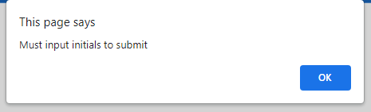
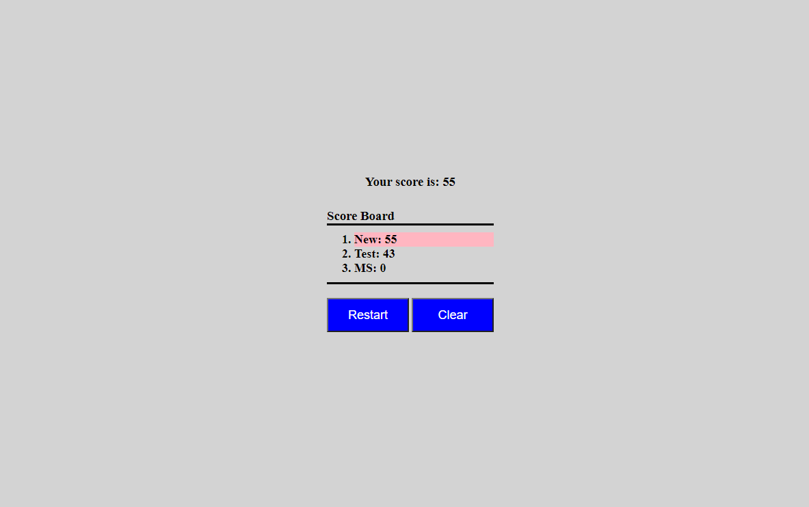

# time-quiz

## Description

The goal was to create a timed, multiple choice, quiz that displays one question at a time and stores users/scores locally. The time remaining when the last question is the users score, and the user can input initials to submit scores to a local leaderboard. By utilizing various functions, I was able to create a timed quiz, that hides and shows different elements as the quiz progresses. For example at page load, the home page is the only portion visible. But when the quiz begins, the current question, answers, and timer are visible. I achieved this by adding and removing a custom class, hide, to elements within various functions. Once the quiz is finished, the user inputs their username; Then, their score is sorted added to the previous scores in local storage and displayed from highest to lowest. While building this quiz, I learned how to utilize multiple functions and event listeners to achieve the perception of multiple pages.

## Table of Contents
- [Installation](#installation)
- [Usage](#usage)
- [Credits](#credits)
- [License](#license)
- [Features](#features)
- [Footer](#tests)

## Installation
N/A

## Usage
Here is the deployed link to the quiz I created. [time-quiz](https://maxstump13.github.io/time-quiz/)

This is what the quiz home page looks like. 

Once the start button is clicked, a timer begins to count down and the first question/answers are displayed as seen below. 

Once an answer is selected, a function is called to check if the answer is correct. A message will be displayed with the result, and if incorrect, 10 seconds will be subtracted. Both are shown below.  

When the last question is answered, or time runs out, the submission screen is displayed with the user score. 

If nothing or a username longer than 5 characters is input, an alert will appear informing the user to input a valid username.  

After a valid username is input, the scoreboard is displayed from highest to lowest with the user's name and score highlighted.

From this screen, the user has the option to restart the quiz, or clear the previous score. If restart is chosen, the timer restarts and question one is displayed. If clear is selected, all users/scores on the leaderboard will be deleted. 

The quiz can also be taken on smaller screens. The button options are listed vertically instead. 

## Credits
1. [w3schools](https://www.w3schools.com/default.asp)
2. [MDN](https://developer.mozilla.org/en-US/)
3. [stackoverflow](https://stackoverflow.com/)
4. [javascripttutorial](https://www.javascripttutorial.net/)
5. [Youtube](https://www.youtube.com/watch?v=riDzcEQbX6k)
6. [GeeksforGeeke](https://www.geeksforgeeks.org/)

## License
[License](./LICENSE)

## Badges
N/A

## Features
1. Clickable buttons that start, check answers, progress quiz and apply score effects, submit user data, clear local storage, and restart
2. Timer that begins on start, subtracted for incorrect answers, and stop at quiz end
3. Timer to display correct or wrong answer
4. Flexboxes to align content in the center of the page
5. Media query to allow use on large and small screens
6. Local storage of previous and current user, displayed on scoreboard
7. Loops to add to, create, delete, sort, and evaluate various types of arrays
8. Date stamp on users to add highlight on the current users score on scoreboard

## How to Contribute
If there are any suggestions to improve this generator, this is my [GitHub](https://github.com/MaxStump13) account. 

## Tests
I tested the quiz by selecting all choices on large and small screens. I also allowed time to run out, testing the timer function. I used the reset and clear functions to confirm the quiz doesn't have bugs on reload. I added an alert to ensure users cannot submit without inputting a name. 